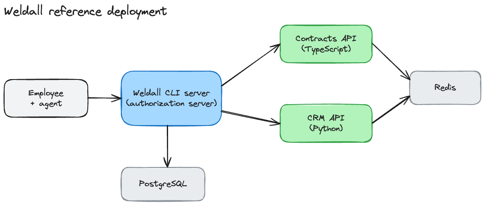

  

  
  
  
  
  
  

---

# Weldall reference deployment

This is an example of how to set up services for [Weldall](https://weldall.ai). It runs on Docker
Compose and contains an authorization server, two resource servers written in different languages,
and a group provider for memberships. The product itself lives in
[seibert-external/weldall](https://github.com/seibert-external/weldall) — make sure to check out that
repository.

An employee asks their agent for the renewal date of a customer's contract. The agent finds the
skill that covers renewals and runs the `weldall request` command it describes. The authorization
server decides whether that employee may read contracts, and the contracts API verifies the request
before it answers.

  

## Services

| Service | Role | What it shows about a deployment |
|---|---|---|
| `weldall` | Authorization server and admin UI, built unmodified from a pinned commit | Upstream runs as one container against PostgreSQL with a public HTTPS origin, an ES256 signing key and a credential-encryption key. Sign-in providers are stored in the database and configured once at `/setup` rather than through environment variables. |
| `contracts` | TypeScript/Hono API serving 20 example contracts | The TypeScript resource-server SDK registers a downstream resource, publishes four skills, protects routes with `contracts:read` and rejects replayed DPoP proofs. |
| `crm` | Python/FastAPI API serving 12 example accounts | The Python SDK, and the group provider interface: the authorization server calls a Token-authenticated directory to resolve group membership. Publishes four skills. |
| `postgres` | Database | Stores users, grants, resources, skill catalogs and audit records. |
| `redis` | Replay store | DPoP proofs are single-use. Both APIs stop answering when Redis is unreachable. |
| `bootstrap` | One-shot job that exits 0 | Registers resources, scopes and a group in one transaction. The same changes are available in the admin UI. |

A contract's `customerId` is an organization ID in the CRM, and an organization's `contractIds`
point back.

## Skills

| Resource | Skills |
|---|---|
| `contracts` | `overview` · `review` · `renewals` · `by-account` |
| `crm` | `briefing` · `contacts` · `activity` · `pipeline` |

## Deploy

1. `npm run generate-env` writes `.env` with new ES256 keys and random secrets, mode `0600`. It does
   not overwrite an existing file.
2. Set `WELDALL_ISSUER`, `CONTRACTS_ORIGIN` and `CRM_ORIGIN` to three distinct HTTPS origins without
   a trailing slash.
3. Deploy `compose.yaml`. In Coolify: build pack *Docker Compose*, compose location `/compose.yaml`,
   domains on `weldall:3000`, `contracts:3001` and `crm:8000`. `postgres`, `redis` and `bootstrap`
   belong to this Compose project; they need neither a domain nor a separate database resource.
4. Open `https://<WELDALL_ISSUER>/setup` and register an OIDC provider. For Google the issuer is
   `https://accounts.google.com` with the scopes `openid profile email`. The form displays the
   callback URL to register with the provider. Authorization answers `503` until this step is done.
5. Point the CLI at the deployment: `weldall config set-issuer https://<WELDALL_ISSUER>`, then
   `weldall login` and `weldall skills list`.

## Limitations

- Use a dedicated database. The example records and the reader policy are not suitable for an
  existing instance.
- Signing keys, the credential-encryption key, the PostgreSQL volume and the Redis volume stay
  unchanged across deployments.
- Back up PostgreSQL and Redis together. Losing replay history makes already-used proofs reusable.
- The `demo-readers` group maps every verified email to read-only access. It is an example policy,
  not an identity check. Publish a privacy notice and a retention policy before exposing it.
- Deleting the application resource in Coolify runs `docker compose down -v` and removes all state.
  A redeploy does not.

Checks: `npm run check`. In `services/crm`: `uv run ruff format --check . && uv run ruff check . && uv run pytest -q`.
